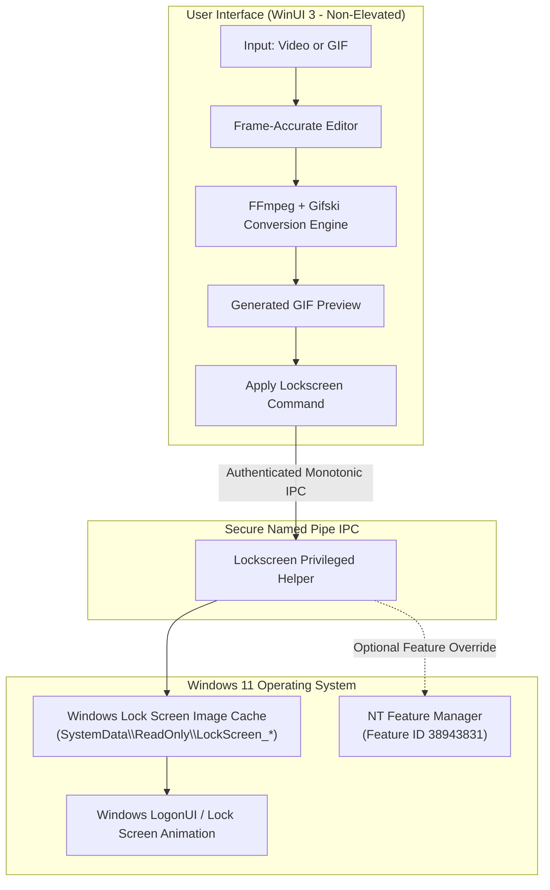

# 🎬 LockscreenGif

**Bring your Windows 11 lock screen to life with fluid, high-definition animated GIFs and videos.**

[-0078D4?style=for-the-badge&logo=windows11&logoColor=white)](https://github.com/SubhamPro11/lockscreengtf)
[](https://dotnet.microsoft.com/download/dotnet/10.0)
[](https://learn.microsoft.com/en-us/windows/apps/winui/winui3/)
[](LICENSE.txt)
[](https://github.com/SubhamPro11/lockscreengtf/actions)

[Features](#-key-features) •
[Demos](#-demos) •
[How It Works](#-how-it-works) •
[Requirements](#-system-requirements) •
[Installation](#-installation) •
[Quick Start](#-quick-start) •
[Troubleshooting](#-diagnostics--troubleshooting) •
[Build from Source](#-building-from-source)

---

## 💡 Overview

By default, Windows natively restricts lock screen customization to static wallpaper images. Even if you rename an animated `.gif` or select a dynamic media file in Windows Settings, Windows either freezes playback on the first frame or fails to display it.

**LockscreenGif** changes that. Built from the ground up for **Windows 11 24H2 and 25H2+**, LockscreenGif bypasses OS-level limitations by safely managing the system lock screen image cache. It features a frame-accurate video editor, a high-fidelity conversion pipeline powered by **FFmpeg** and **Gifski**, an out-of-process privileged helper service, and a built-in diagnostic and ETW tracing suite.

> [!TIP]
> LockscreenGif is fully reversible at any time with a single click in Settings, returning your lock screen to its standard Windows background.

---

## 🎬 Demos

See LockscreenGif in action below:

| Video Input & Trim Demo | Direct GIF Input Demo |
| :---: | :---: |
| [](https://github.com/user-attachments/assets/1dc4ec39-2f38-42c6-8216-3c911f6d8bc9) | [](https://github.com/Leapward-Koex/LockscreenGif/assets/30615050/7448e59f-9767-4509-8ce3-721cf1783faa) |
| *Turn any MP4, MKV, or WEBM into a looped lockscreen animation.* | *Select any high-resolution GIF file and apply it instantly.* |

Direct video streams:

- 📹 [Video Input & Trimming Walkthrough (MP4)](https://github.com/user-attachments/assets/1dc4ec39-2f38-42c6-8216-3c911f6d8bc9)
- 🖼️ [Direct GIF Application Walkthrough (MP4)](https://github.com/Leapward-Koex/LockscreenGif/assets/30615050/7448e59f-9767-4509-8ce3-721cf1783faa)

---

## ✨ Key Features

### 🎞️ Frame-Accurate Video Trimming

- **Interactive Filmstrip Timeline:** Scrub through your video with live frame preview rendering.
- **Microsecond Boundary Snapping:** Set exact Start and End points (`mm:ss.fff` or frame index).
- **Fine Adjustment Controls:** Jump directly to boundaries or nudge by `−1 frame` / `+1 frame` with dedicated repeat buttons.
- **Seamless Looping Preview:** Preview the selected loop continuously before committing.

### ⚡ Studio-Grade GIF Conversion Engine

- **FFmpeg & Gifski Pipeline:** Preserves crisp color fidelity, optimal dithering, and custom color palettes without banding.
- **Variable Frame Rate & Timestamp Handling:** Retains exact source frame timing and fractional delays.
- **Custom Output Presets:** Configure target output resolution, scaling, and target FPS (from original rate down to custom intervals).
- **Export to Disk:** Use **Save GIF…** to export your converted animation anywhere on your PC for reuse.

### 🛡️ Least-Privilege Helper Architecture

- **Non-Admin Main UI:** The WinUI 3 front-end runs unelevated under standard user privileges.
- **Authenticated Privileged Helper:** Cache updates and ACL maintenance are delegated to a dedicated helper process (`LockscreenGif.Privileged.Helper`) via secure Named Pipe IPC.
- **Atomic Cache Updates:** Writes are verified byte-for-byte to prevent cache corruption.

### 🧩 Windows 11 24H2 & 25H2+ Compatibility

- **Automated Prerequisite Checks:** Real-time validation of Windows Lock Screen mode (Picture Mode) and local cache accessibility.
- **NT Feature Management Override:** Built-in override support for Windows image-loading feature ID `38943831` (`RtlSetFeatureConfigurations`), restoring animated GIF playback on Windows 11 25H2 (Build 26200+) without patching OS binaries. Learn more in [docs/windows-image-feature.md](docs/windows-image-feature.md).

### 🩺 Deep Diagnostics & ETW Tracing

- **Real-Time ETW Tracing:** Monitors disk and file I/O events to verify lock screen cache read operations.
- **Automated Test Cycle:** 5-second countdown to automatic lock screen test (`Win` + `L`) with immediate post-unlock findings verification.
- **One-Click Diagnostic ZIP Export:** Generates sanitized reports with zero personal paths or credentials for easy troubleshooting. See [docs/diagnostics.md](docs/diagnostics.md).

### 🔒 Privacy by Design

- **Zero Tracking of Personal Files:** Filenames, file paths, media content, and Windows account credentials are never logged or transmitted.
- **Optional Anonymous Telemetry:** Bounded reliability metrics (PostHog EU) can be toggled off at any time in Settings. See [docs/analytics.md](docs/analytics.md).

---

## 🔍 How It Works



1. **Input & Preparation:** You choose a GIF or video file. For videos, you trim the exact segment and choose resolution/FPS in the built-in editor.
2. **High-Definition Encoding:** FFmpeg decodes exact PTS presentation timestamps, while Gifski creates an optimized palette and animated GIF.
3. **Privileged Delegation:** The application requests an authenticated IPC call to `LockscreenGif.Privileged.Helper`.
4. **Cache Injection & Verification:** The helper updates the user's specific Windows Lock Screen cache under `SystemData` and verifies the written hash.
5. **Playback:** Windows `LogonUI` reads the updated cache file when you lock your computer (`Win` + `L`) and plays the looping animation.

---

## 📋 System Requirements

| Component | Minimum Requirement | Notes |
| :--- | :--- | :--- |
| **Operating System** | **Windows 11 64-bit (x64)** | Build 26100 (24H2) or later (including 25H2+) |
| **Runtime** | **Microsoft .NET 10 Desktop Runtime (x64)** | Required. Must be installed prior to running the app. |
| **Privileges** | **Administrator Rights** | Required during initial install / helper service authorization. |
| **Lock Screen Mode** | **Picture Mode** | Lock screen mode in Windows Settings must be set to *Picture* (not *Windows Spotlight* or *Slideshow*). |
| **Visual Effects** | **Animation Effects On** | Windows Settings > Accessibility > Visual Effects > *Animation effects* must be enabled. |

> [!IMPORTANT]
> Download the **.NET 10 Desktop Runtime (x64)** from Microsoft's official portal:
> 👉 **[Download .NET 10 Desktop Runtime](https://dotnet.microsoft.com/download/dotnet/10.0)**

---

## 🚀 Installation

Choose your preferred installation method:

### Method 1: Windows Installer (MSI) — Recommended

1. Download the latest `LockscreenGif-<version>-x64.msi` from [Releases](https://github.com/SubhamPro11/lockscreengtf/releases).
2. Ensure [.NET 10 Desktop Runtime (x64)](https://dotnet.microsoft.com/download/dotnet/10.0) is installed.
3. Run the installer and complete the setup wizard.
4. Launch **LockscreenGif** from your Start Menu or Desktop.

---

### Method 2: Portable ZIP Package

1. Download `LockscreenGif-<version>-win-x64.zip` from [Releases](https://github.com/SubhamPro11/lockscreengtf/releases).
2. Extract the archive to any folder (e.g., `C:\Tools\LockscreenGif`).
3. Ensure [.NET 10 Desktop Runtime (x64)](https://dotnet.microsoft.com/download/dotnet/10.0) is installed.
4. Launch `LockscreenGif.exe`.

---

## 📖 Quick Start

LockscreenGif uses a streamlined 4-step workflow:

```text
[ 1 · Choose ]  ──▶  [ 2 · Edit ]  ──▶  [ 3 · Set ]  ──▶  [ ✓ Applied ]
```

1. **Choose Your Media**
   - Select "Choose video" to import MP4, MKV, or WEBM.
   - Or select "Choose GIF" to use an existing animated image.

2. **Trim & Customize** (Videos only)
   - Use the timeline handles or nudge buttons (−1 / +1 frame) to select your clip.
   - Adjust Output Settings (resolution & FPS) if desired.
   - Click Continue to generate the GIF preview.

3. **Preview & Apply**
   - Verify the generated animation in the preview card.
   - Optionally click "Save GIF…" to keep a standalone copy.
   - Click "Set lock screen".

4. **Lock and Enjoy!**
   - Press `Win` + `L` to lock your computer and admire your new animated lock screen!

---

## 🛠️ Diagnostics & Troubleshooting

LockscreenGif includes an integrated diagnostics panel accessible via **Diagnostics** in the navigation bar.

### Common Scenarios & Solutions

| Issue | Cause | Recommended Solution |
| :--- | :--- | :--- |
| **Animation is static / does not move** | Windows Spotlight or Slideshow is active | Open **Windows Settings > Personalization > Lock screen** and set the background to **Picture**. |
| **Animation is still on Windows 11 25H2+** | Windows image feature restricts GIF loading | Open LockscreenGif **Prerequisites** or **Settings**, click **Disable Windows feature** (Feature ID `38943831`), and restart your PC. See [docs/windows-image-feature.md](docs/windows-image-feature.md). |
| **Screen stays black or still** | Windows visual animation effects are turned off | Enable **Settings > Accessibility > Visual effects > Animation effects**. |
| **Permission or cache access error** | Windows protected lock screen cache permissions | Click **Check again** in prerequisites or start a Diagnostic run. Grant the UAC elevation prompt when the helper repairs cache access. |
| **Black borders or stretching after display change** | Primary display resolution was modified | Open LockscreenGif and re-apply your animation so the cache matches the new display dimensions. |
| **Need to revert back to default** | Want to restore original Windows lock screen | Go to **Settings > Remove Animated Lockscreen** and click **Remove**. |

### Exporting Diagnostic Bundles

If you run into an unexpected issue:

1. Open the **Diagnostics** tab.
2. Select your GIF (or check *Use bundled reference animation*).
3. Click **Start test** and let the 5-second countdown lock your screen.
4. Unlock your PC and click **Export report** to save a sanitized ZIP diagnostic report.
5. Attach the ZIP when opening a [GitHub Issue](https://github.com/SubhamPro11/lockscreengtf/issues).

---

## 🧑‍💻 Building from Source

### Prerequisites

- **Windows 11 (x64)** (Build 26100 or later)
- **[.NET 10 SDK](https://dotnet.microsoft.com/download/dotnet/10.0)** (matches `global.json`)
- **Visual Studio 2022 / 2025** (with *.NET Desktop Development* workload) or **VS Code** with C# Dev Kit
- **PowerShell 7+ (`pwsh`)**

### Build Steps

1. **Clone the repository:**

   ```powershell
   git clone https://github.com/SubhamPro11/lockscreengtf.git
   cd lockscreengtf
   ```

2. **Restore dependencies & tools:**

   ```powershell
   dotnet restore
   dotnet tool restore
   ```

3. **Build the solution:**

   ```powershell
   dotnet build LockscreenGif.sln -c Release
   ```

4. **Run regression tests:**

   ```powershell
   Get-ChildItem Tests -Recurse -Filter *.csproj | ForEach-Object {
       dotnet run --project $_.FullName -c Release
   }
   ```

5. **Publish the desktop application:**

   ```powershell
   dotnet publish LockScreenGif/LockscreenGif.csproj -c Release -p:PublishProfile=FolderProfile
   ```

   *Compiled binaries will be created in `artifacts/app/`.*

6. **Format C# code before committing:**

   ```powershell
   ./scripts/Format-CSharp.ps1
   ```

   *To verify formatting in CI without modifying files:*

   ```powershell
   ./scripts/Format-CSharp.ps1 -Check
   ```

---

## 📂 Repository Structure

```text
LockscreenGif/
├── LockScreenGif/                    # Main WinUI 3 Desktop Application
│   ├── Activation/                   # App lifecycle & activation handlers
│   ├── CustomControls/               # VideoTimeline & interactive filmstrip
│   ├── Models/                       # Domain models & telemetry contracts
│   ├── Services/                     # Lockscreen cache, frame indexer, analytics
│   ├── ViewModels/                   # MVVM CommunityToolkit ViewModels
│   ├── Views/                        # MainPage, SettingsPage, DiagnosticsPage
│   └── Vendor/                       # Bundled FFmpeg and Gifski native binaries
├── LockscreenGif.Privileged.Contracts # Shared IPC data contracts & protocol
├── LockscreenGif.Privileged.Helper   # Authenticated elevated helper service
├── Tests/                            # Test suites & packaging verifications
├── docs/                             # Architecture & feature documentation
│   ├── video-editing.md              # Frame indexing & conversion pipeline specs
│   ├── windows-image-feature.md      # Feature ID 38943831 NT internals guide
│   ├── diagnostics.md                # Real-time ETW diagnostics & findings guide
│   ├── analytics.md                  # Telemetry schema & privacy contract
│   └── code-style.md                 # CSharpier formatting & style rules
└── scripts/                          # Automated formatting and packaging scripts
```

---

## 🤝 Contributing

Contributions, bug reports, and feature requests are welcome!

- Please check existing [Issues](https://github.com/SubhamPro11/lockscreengtf/issues) before opening a new one.
- Ensure all code conforms to repository code style rules via `./scripts/Format-CSharp.ps1`.
- Verify tests pass cleanly using `dotnet test` or running the test suites under `Tests/`.

---

## 📄 License

This project is licensed under the [MIT License](LICENSE.txt).

Third-party dependencies:

- **[FFmpeg](https://www.ffmpeg.org/)** — Licensed under LGPL / GPL.
- **[Gifski](https://gif.ski/)** — High-quality GIF encoder library.
- **[WinUI 3 / Windows App SDK](https://github.com/microsoft/WindowsAppSDK)** — Licensed under the MIT License.
- **[CommunityToolkit.Mvvm](https://github.com/CommunityToolkit/dotnet)** — Licensed under the MIT License.
